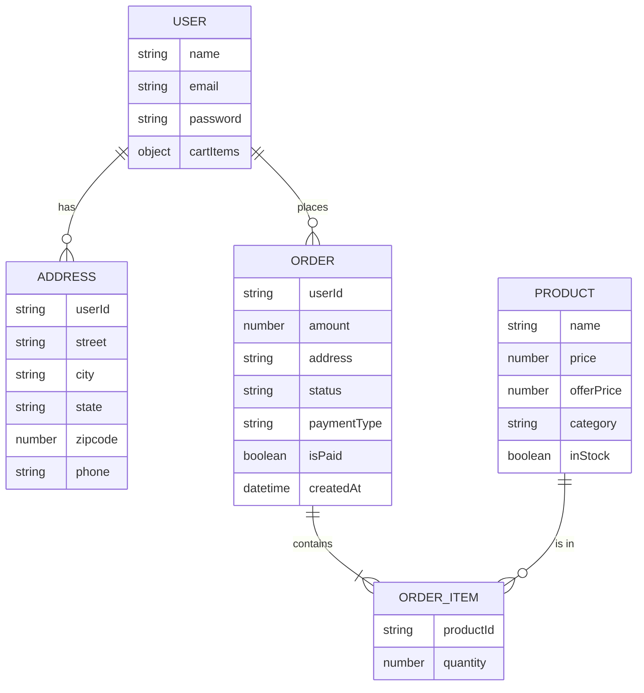

# Entity Relationship Diagram

```mermaid
erDiagram
    USER ||--o{ ADDRESS : "has"
    USER ||--o{ ORDER : "places"
    ORDER ||--|{ ORDER_ITEM : "contains"
    PRODUCT ||--o{ ORDER_ITEM : "is in"

    USER {
        string name
        string email
        string password
        object cartItems
    }

    ADDRESS {
        string userId
        string street
        string city
        string state
        number zipcode
        string phone
    }

    ORDER {
        string userId
        number amount
        string address
        string status
        string paymentType
        boolean isPaid
        datetime createdAt
    }

    PRODUCT {
        string name
        number price
        number offerPrice
        string category
        boolean inStock
    }

    ORDER_ITEM {
        string productId
        number quantity
    }
```
