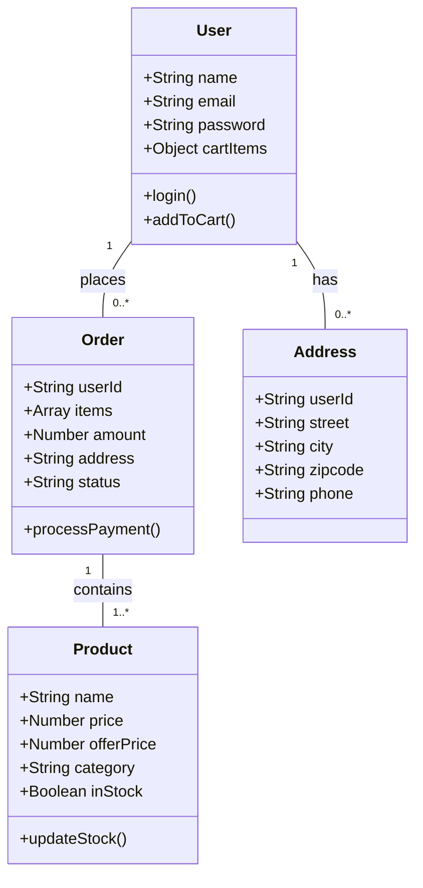

# Class Diagram (Major Entities)

```mermaid
classDiagram
    class User {
        +String name
        +String email
        +String password
        +Object cartItems
        +login()
        +addToCart()
    }

    class Product {
        +String name
        +Number price
        +Number offerPrice
        +String category
        +Boolean inStock
        +updateStock()
    }

    class Order {
        +String userId
        +Array items
        +Number amount
        +String address
        +String status
        +processPayment()
    }

    class Address {
        +String userId
        +String street
        +String city
        +String zipcode
        +String phone
    }

    User "1" -- "0..*" Order : places
    User "1" -- "0..*" Address : has
    Order "1" -- "1..*" Product : contains
```
