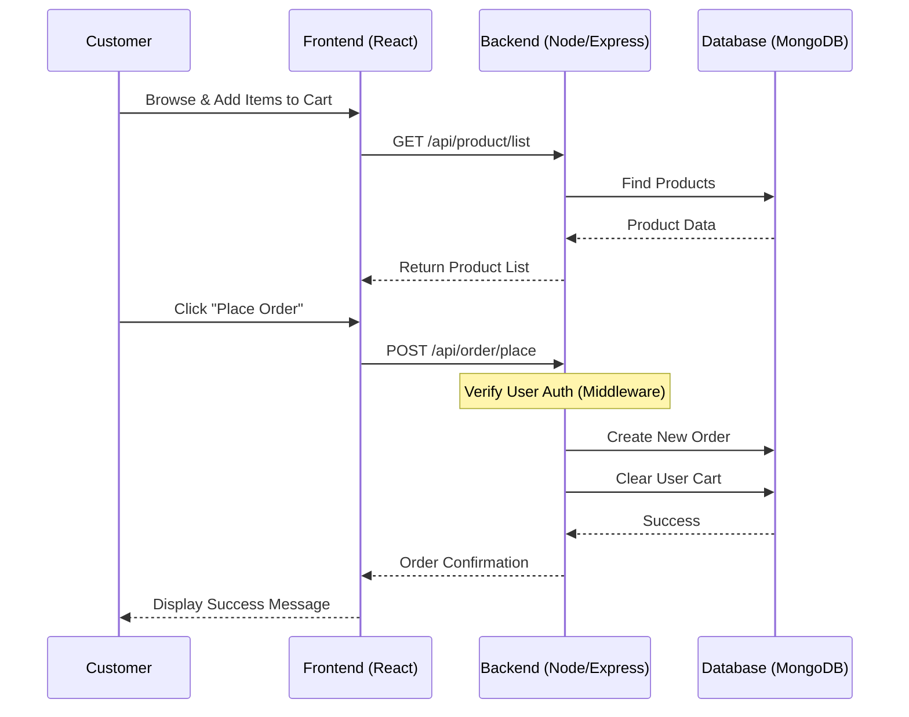

# Sequence Diagram (Main Order Flow)

```mermaid
sequenceDiagram
    participant C as Customer
    participant F as Frontend (React)
    participant B as Backend (Node/Express)
    participant D as Database (MongoDB)

    C->>F: Browse & Add Items to Cart
    F->>B: GET /api/product/list
    B->>D: Find Products
    D-->>B: Product Data
    B-->>F: Return Product List
    
    C->>F: Click "Place Order"
    F->>B: POST /api/order/place
    Note over B: Verify User Auth (Middleware)
    B->>D: Create New Order
    B->>D: Clear User Cart
    D-->>B: Success
    B-->>F: Order Confirmation
    F-->>C: Display Success Message
```
